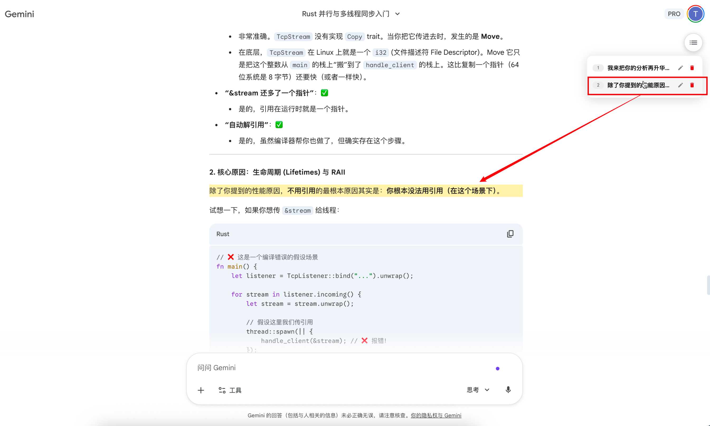

# Gemini Anchor - 记忆锚点 (Memory Anchor) 📍

> [English Version below](#-english-introduction)

**Gemini Anchor** 是一个专为 Google Gemini 长对话设计的“生产力级”书签工具。
它允许你在对话的**任意位置**打上标记，并将其持久化保存。即使刷新页面，脚本也能通过智能文本匹配找回你的阅读位置。

 

## ✨ 核心功能

* **🎯 任意位置标记**: 这是一个自由度极高的系统。按住 **`Alt` + `右键`** 即可在任意文字段落、代码块或图片上添加书签。
* **💾 持久化记忆**: 书签数据保存在本地 (LocalStorage)。每个对话（URL）拥有独立的书签库，刷新页面或重启浏览器后书签依然存在。
* **🧠 智能恢复**: Gemini 刷新后 DOM 元素会重置？没关系。脚本内置文本指纹算法，能自动在页面重新加载后重新定位到原来的段落。
* **🎨 丝滑的 UI**: 极简的悬浮球设计。鼠标悬停自动展开书签列表，支持**编辑重命名**和**删除**，点击即可平滑滚动并高亮目标。
* **🔒 安全隐私**: 所有数据仅存储在你的浏览器本地，不会上传到任何服务器。

## 🚀 安装方法

1.  首先安装浏览器扩展 **Tampermonkey (篡改猴)**: [Chrome](https://chrome.google.com/webstore/detail/tampermonkey/dhdgffkkebhmkfjojejmpbldmpobfkfo) | [Edge](https://microsoftedge.microsoft.com/addons/detail/tampermonkey/iikmkjmpaadaobahmlepeloendndfphd) | [Firefox](https://addons.mozilla.org/en-US/firefox/addon/tampermonkey/)
2.  **[点击此处安装脚本](gemini-anchor.user.js)** *(注意：点击后请在弹出的页面中点击 "Install" 或 "安装")*

## 📖 使用指南

1.  **添加书签**: 
    * 将鼠标移动到你想标记的文字上。
    * 按住键盘 **`Alt`/`Option`** 键，同时点击鼠标 **`右键`**。
    * 看到蓝色波纹动画即表示添加成功。
2.  **查看列表**: 
    * 鼠标悬停在页面右上角的 **悬浮球** 上，列表会自动展开。
3.  **跳转**: 
    * 点击列表中的任意一项，页面会自动滚动到该位置并高亮提示。
4.  **管理**: 
    * 点击 ✏️ 图标可以重命名书签。
    * 点击 🗑️ 图标可以删除书签。

---

# ⚓ Gemini Anchor - Memory Anchor

**Gemini Anchor** is a productivity-grade bookmarking tool designed specifically for long conversations in Google Gemini.
It allows you to place anchors **anywhere** in the chat and persists them locally. Even after refreshing the page, the script intelligently locates your reading position using text matching.

## ✨ Key Features

* **🎯 Tag Anywhere**: High freedom. Hold **`Alt` + `Right Click`** on any text paragraph, code block, or image to add a bookmark.
* **💾 Persistent Storage**: Bookmarks are saved in LocalStorage. Each conversation (URL) has its own independent bookmark registry. Data survives page refreshes and browser restarts.
* **🧠 Smart Restoration**: Does the DOM reset after a refresh? No problem. The script uses a text fingerprinting algorithm to re-locate your specific paragraph after the page reloads.
* **🎨 Smooth UI**: Minimalist floating action button (FAB). Hover to auto-expand the bookmark list. Supports **renaming** and **deleting**. Click to smooth-scroll and highlight the target.
* **🔒 Privacy First**: All data is stored locally in your browser. No data is sent to any server.

## 🚀 Installation

1.  Install the **Tampermonkey** extension for your browser: [Chrome](https://chrome.google.com/webstore/detail/tampermonkey/dhdgffkkebhmkfjojejmpbldmpobfkfo) | [Edge](https://microsoftedge.microsoft.com/addons/detail/tampermonkey/iikmkjmpaadaobahmlepeloendndfphd) | [Firefox](https://addons.mozilla.org/en-US/firefox/addon/tampermonkey/)
2.  **[Click Here to Install Script](gemini-anchor.user.js)** *(Note: After clicking, select "Install" in the Tampermonkey tab)*

## 📖 Usage

1.  **Add Bookmark**: 
    * Hover over the text you want to mark.
    * Hold **`Alt`/`Option`** and **`Right Click`**.
    * A blue ripple effect confirms the anchor is set.
2.  **View List**: 
    * Hover over the **Floating Ball** in the top-right corner to expand the list.
3.  **Navigate**: 
    * Click any item in the list to smooth-scroll to that position with a highlight effect.
4.  **Manage**: 
    * Click the ✏️ icon to rename a bookmark.
    * Click the 🗑️ icon to delete it.

---

### 🛠️ Compatibility / 兼容性
* **Browser**: Chrome, Edge, Firefox, Safari (via Userscript manager).
* **Manager**: Tampermonkey (Recommended), Violentmonkey.
* **Target**: https://gemini.google.com/*

### 📝 License
Distributed under the MIT License. See `LICENSE` for more information.
